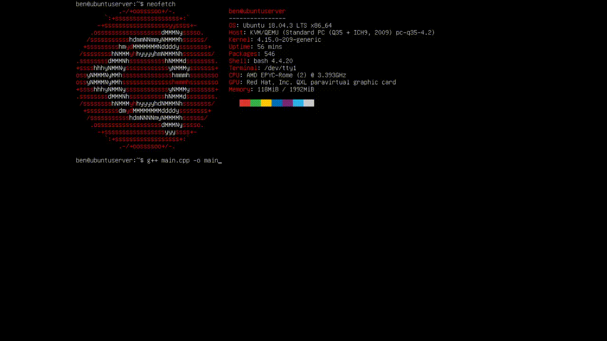

# FBDirect
Experimental project to test writing directly to the [Linux frame buffer](https://en.wikipedia.org/wiki/Linux_framebuffer) with C++.
The program adapts to video devices with different resolutions and low-level pixel formats.

Only functional on Linux systems without a desktop environment (i.e. Ubuntu Server, Raspberry Pi OS Lite).

Demonstration:

